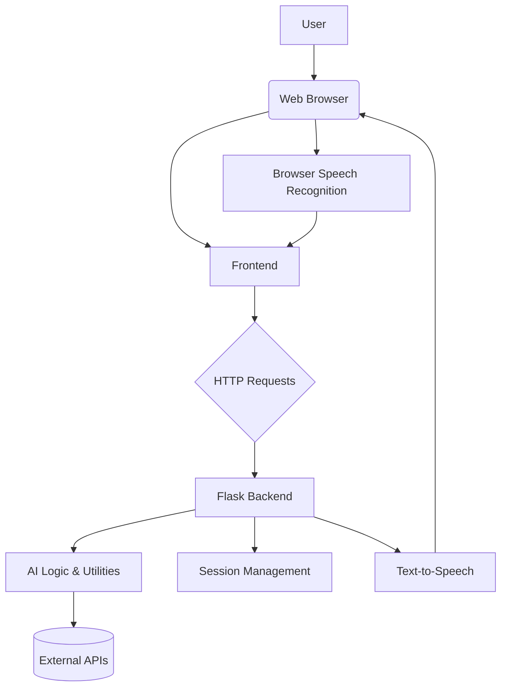
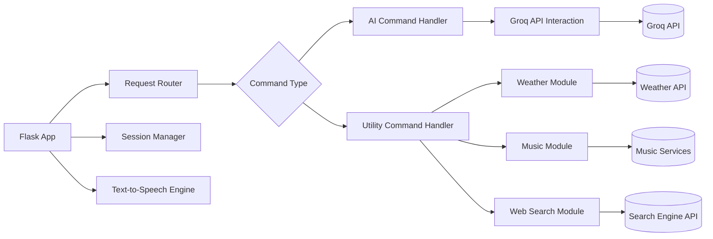
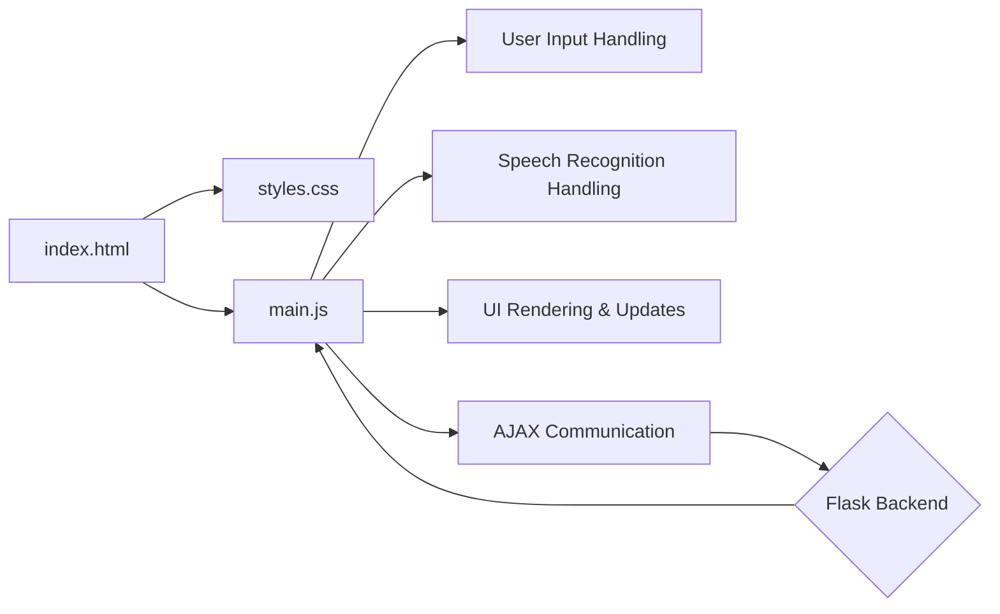

# Parker AI Assistant - Architecture

This document describes the architecture of the Parker AI Assistant project.

## High-Level Architecture

**Explanation:**

- **User:** Interacts with the application through the web browser.
- **Web Browser:** Runs the frontend code and handles browser-based speech recognition.
- **Frontend (HTML, CSS, JS):** Provides the user interface, handles user input (text and voice), and sends requests to the backend.
- **HTTP Requests:** Communication channel between the frontend and the backend.
- **Flask Backend:** Receives requests from the frontend, processes them, interacts with AI logic and utilities, manages sessions, and sends responses back to the frontend.
- **AI Logic & Utilities:** Contains the core logic for interacting with the AI model (Groq) and other utility functions (weather, music, web search, etc.).
- **External APIs:** Third-party services used by the AI Logic & Utilities (e.g., Groq API, OpenWeatherMap API).
- **Session Management:** Handles storing and retrieving conversation history and potentially user settings.
- **Text-to-Speech:** Converts the AI's text responses into speech, sent back to the browser.
- **Browser Speech Recognition:** Converts the user's spoken input into text in the browser.

## Backend Component Diagram

**Explanation:**

- **Flask App:** The main entry point for the backend.
- **Request Router:** Directs incoming HTTP requests to the appropriate handler.
- **Command Type:** Determines if the command is for the AI or a specific utility.
- **AI Command Handler:** Processes commands directed to the AI.
- **Utility Command Handler:** Processes commands for specific utilities like weather, music, or web search.
- **Groq API Interaction:** Handles communication with the Groq API.
- **Weather Module:** Interacts with the weather API.
- **Music Module:** Interacts with music services.
- **Web Search Module:** Interacts with a search engine API.
- **Session Manager:** Manages the conversation history and session data.
- **Text-to-Speech Engine:** Converts text responses to speech.

## Frontend Component Diagram

**Explanation:**

- **index.html:** The main HTML structure of the web page.
- **styles.css:** Provides the styling for the user interface.
- **main.js:** The main JavaScript file handling frontend logic.
- **User Input Handling:** Processes text input from the user.
- **Speech Recognition Handling:** Processes voice input from the user using the browser's Web Speech API.
- **UI Rendering & Updates:** Dynamically updates the chat interface and other UI elements.
- **AJAX Communication:** Handles sending requests to and receiving responses from the Flask backend.
- **Flask Backend:** Represents the backend that the frontend communicates with.
